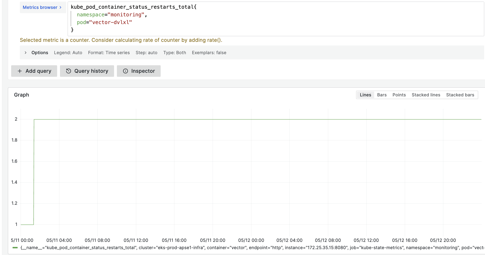
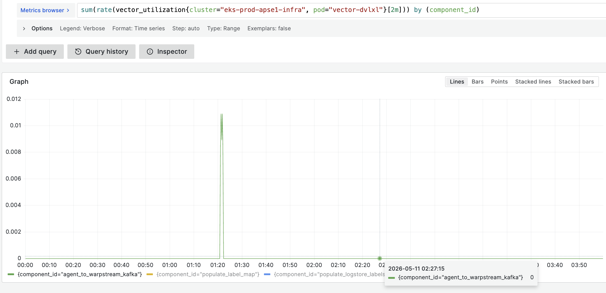
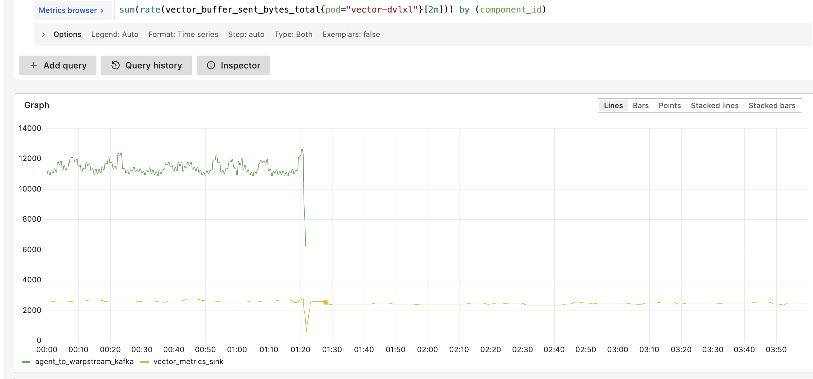
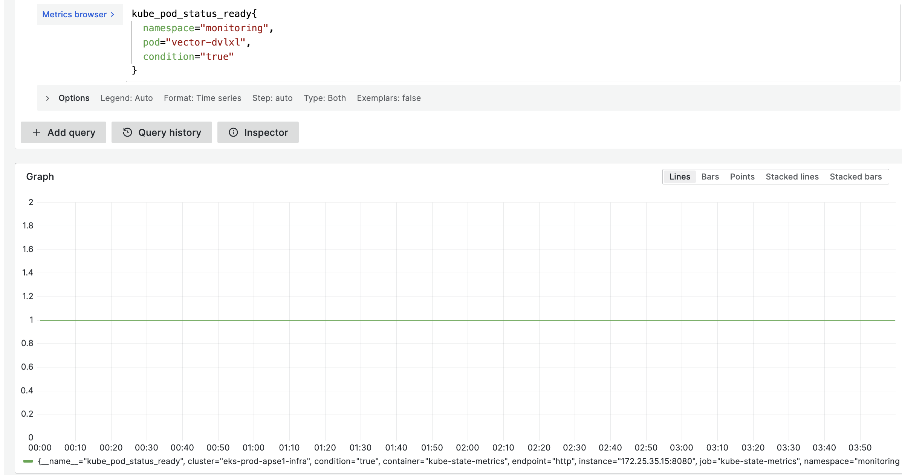
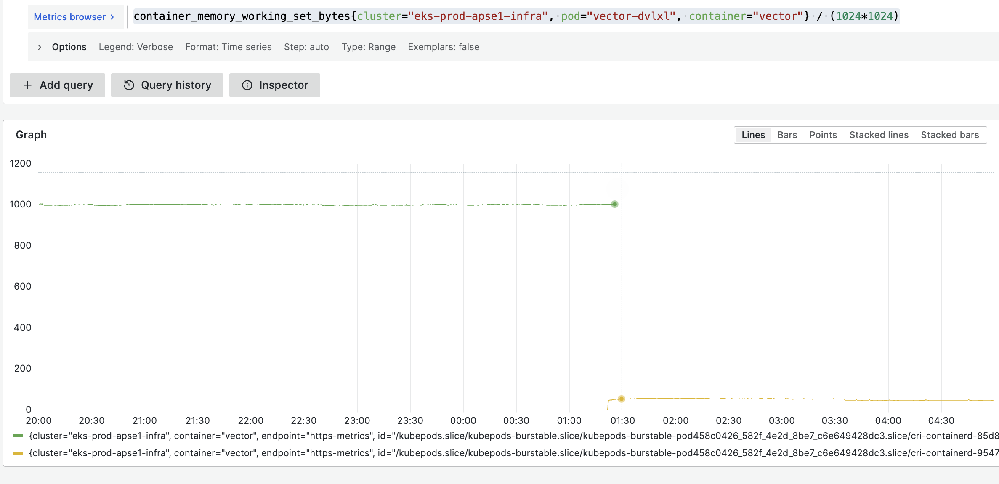

+++
title = "Investigating a Vector Daemonset Pod Failure"
date = 2026-06-08
draft = false
tags = ["post-mortem", "k8s", "vector"]
+++

**Cluster:** eks-prod-apse1-infra \
**Node:** ip-172-27-51-17.ap-southeast-1.compute.internal \
**Duration of silent failure:** ~9.5 days

---

## Background: How our observability pipeline works

At Blinkit, logs flow through a multi-stage Vector pipeline before they reach Grafana Cloud:

```
Pod stdout on each node
        ↓
Vector DaemonSet agent (one pod per node)
        ↓  [disk buffer → Kafka sink]
WarpStream Kafka topic
        ↓
Vector stateless aggregator (infra cluster)
  - filters by cluster
  - whitelists important namespaces
        ↓
Loki → Grafana Cloud
```

The Daemonset agent is the entry point for every log on every node. If it stops working, the entire node goes dark, just not one service.

---

## What we saw

One of our engineers initially reported this as missing logs from `vector-spotinst` in the monitoring namespace. What looked like a single-service problem turned out to be a node-wide failure: the Vector Daemonset pod responsible for collecting logs from all pods on node `ip-172-27-51-17` had silently stopped shipping data.

Deleting the stuck pod fixed the issue immediately. But this wasn't the first time. We'd seen Vector pods get stuck since introducing it into our pipeline, and this time we wanted to understand why.

Tracing back through metrics, we identified **11 May 2026, ~01:20 IST** as the point where the node went completely dark. At the time of investigation, all pods on the affected node appeared healthy:

```bash
kubectl get pods --field-selector spec.nodeName=ip-172-27-51-17.ap-southeast-1.compute.internal
```

```
NAME                                                    READY   STATUS    RESTARTS   AGE
app-metrics-thanos-query-frontend-7bf787c445-447dw      1/1     Running   0          62d
datadog-agent-psvc7                                     2/2     Running   0          12h
kube-prometheus-stack-prometheus-node-exporter-bfchn    1/1     Running   0          12d
vector-cloudflare-logs-59ffb996c9-892kg                 1/1     Running   0          23d
vector-iot-telemetry-events-consumer-58bcb4978b-pgjd2   1/1     Running   0          61d
vector-spotinst-logs-5f568b84f7-n98h9                   1/1     Running   0          41d
vector-zznvr                                            1/1     Running   0          18d
```

Kubernetes showed no problem. No restarts, no evictions, no alerts. That turned out to be a core part of why this lasted nine and a half days.

---

## Investigation

Going in, we had three open questions:

1. Why was the pod killed?
2. Why didn't it recover after restart?

### Step 1: Find out what happened to the pod

The pod had restarted once and was currently running. We didn't know yet whether the restart was the cause of the stuck state or a symptom of something else. The first thing to check was what actually killed it.

```promql
kube_pod_container_status_last_terminated_reason{
  cluster="eks-prod-apse1-infra",
  pod="vector-dvlxl"
}
```

This came back as `OOMKilled`. The container had exceeded its memory limit and been killed by Kubernetes.

```promql
increase(kube_pod_container_status_restarts_total{
  cluster="eks-prod-apse1-infra",
  pod="vector-dvlxl"
}[1m])
```

A single sharp restart at ~01:20 IST on 11 May, then flat. The pod restarted once, came back up, and never crashed again. So the `OOMKill` explained the restart but it didn't explain why the pod was still dark nine days later. A restart should have recovered it.



### Step 2: Verify that Vector components were actually running after restart

We assumed the restart had fixed things. To check, we looked at component-level utilisation across the pipeline.

```promql
sum(rate(vector_utilization{
  cluster="eks-prod-apse1-infra",
  pod="vector-dvlxl"
}[2m])) by (component_id)
```

It hadn't. The `agent_to_warpstream_kafka` component dropped to zero utilisation after 01:20 and never recovered. Every other component showed non-zero utilisation; the source was still reading logs, transforms were still running. Only the Kafka sink was dead.



### Step 3: Confirm via buffer metrics

Vector places a buffer in front of each sink to handle backpressure. If the sink stops draining, events queue up in the buffer instead of being dropped. We use disk buffers, which persist to `/var/lib/vector` on the node. That persistence detail becomes relevant shortly.

```promql
sum(rate(vector_buffer_sent_bytes_total{
  cluster="eks-prod-apse1-infra",
  pod="vector-dvlxl"
}[2m])) by (component_id)
```

The bytes-sent rate for `agent_to_warpstream_kafka` dropped sharply at restart, then the metric series disappeared entirely. Not a value of zero but it just stopped existing. The sink wasn't just slow; it had stopped reporting altogether.



### Step 4: Rule out a Kafka-side issue

Before going deeper into Vector internals, we needed to check whether the problem was on our side or Warpstream's. We verified the pod's readiness state across the full gap.

```promql
kube_pod_status_ready{
  pod="vector-dvlxl",
  namespace="monitoring",
  condition="true"
}
```

The pod reported `Ready=True` across all ~480 data points in the 11-day window. No eviction, no further restart, no Kubernetes-side signal of any kind. Combined with every other Vector component running normally, this ruled out a platform-level or Kafka-side failure. The problem was entirely within Vector's Kafka sink.



**The pattern was clear: the process was alive, the source pipeline was running, but the Kafka sink had shut down completely and was not recovering on its own.**

---

## Understanding what went wrong

The investigation split cleanly into two parts. Why the pod never recovered after restart, has a probable explanation backed by an upstream bug report and matching behaviour. While the entirety of the behaviour is not confirmed, after repeated observations in the past, this was a very likely cause.

What actually caused the `OOMKill` is up for debate. We know it happened. We don't know why.

### The OOMKill: confirmed, cause unknown

What we know from metrics: in the ~11 hours before the kill that we could observe, the container was sitting at 993–1,052 MB which is right around its 1 GiB limit. The disk buffer was healthy at ~130 KB immediately before the kill, which rules that out as the memory source. Then at **01:31 IST on 11 May**, it was killed.



What we don't know: what pushed it fractionally over the limit on that specific night.

The librdkafka configuration is worth noting here. Vector's Kafka sink uses librdkafka under the hood, and we had configured its in-memory produce queue ceiling at 4 GiB (four times the container's memory limit):

```yaml
librdkafka_options:
  queue.buffering.max.kbytes: '4194304'   # 4 GiB in-memory produce buffer
  queue.buffering.max.messages: '1000000'
```

When a Kafka broker is unreachable, librdkafka holds unsent produce requests in memory while retrying. With a 4 GiB ceiling and a 1 GiB container limit, a connectivity blip could push the container over the edge before librdkafka hit its own maximum.

However, this doesn't fully hold up as the explanation. The container appears to have been running at near-1 GiB memory consistently and this wasn't a sudden spike. If a brief Warpstream blip caused librdkafka to pile up in-memory batches, we'd expect to see this pattern repeating across other OOMKills over time. We didn't. It happened once.

The actual trigger could have been anything: an unusually large log batch or a one-off internal Vector allocation. We don't have a longer memory lookback, and we don't have Warpstream broker metrics for this window.

The OOMKill cause is genuinely undetermined.

### Why the restart didn't fix it: disk buffer WAL corruption

An `OOMKill` is not a graceful shutdown. The process is killed immediately with no time to flush or close open files. Vector writes log events to its disk buffer WAL (write-ahead log) before forwarding them to Kafka. If Vector was mid-write at the moment it was killed, the last record in that WAL file is left incomplete.

On the next startup, the buffer reader hits this partial record and cannot deserialize it. It logs an error and stops. The Kafka sink never sends another byte. The source pipeline (which has no visibility into the sink's state) keeps running as if nothing happened.

This is a known bug in Vector, documented in the Github Issue [18336](https://github.com/vectordotdev/vector/issues/18336). A Vector core contributor confirmed the mechanism. A collaborator confirmed the status: it is a bug with no automated recovery, and the only known workaround is deleting the buffer directory.

The error Vector emits when it hits this state:

```
ERROR vector_buffers::variants::disk_v2::writer:
Last written record was unable to be deserialized. Corruption likely.
reason="invalid data: check failed for struct member payload:
pointer out of bounds: ..."
```

We didn't get this log during this particular timeline. But this behaviour was noticed in our other production clusters, where we notice this same log before a pod is `OOMKilled`. The behaviour also matches exactly: source running, Kafka sink immediately and permanently dead, process healthy, no self-recovery.

The important detail: the disk buffer lives on a `hostPath` mount at `/var/lib/vector`. This means it survives container restarts. When Kubernetes restarted the container after the OOMKill, the new process started with the same corrupt buffer files. A container restart alone could never have fixed this.

### Why Kubernetes never intervened

Vector's readiness probe was configured against the `/health` API endpoint:

```yaml
readinessProbe:
  httpGet:
    path: /health
    port: api
```

That endpoint confirms the process is running. It has no knowledge of whether data is flowing through the pipeline. A Vector process that's internally deadlocked (source blocked, buffer full, Kafka sink permanently dead) returns the same healthy response as one working correctly.

Kubernetes saw a healthy pod for nine and a half days and had no reason to act. "The process is alive" and "the pipeline is working" are two completely different things, and we were only checking one of them.

---

## Root cause

Two failures in sequence, with different levels of confidence:

**Failure 1 — OOMKill:** The container was running at near-1 GiB memory which was its configured limit and was killed. What pushed it over the limit on this specific occasion is undetermined. The librdkafka in-memory queue configuration (4 GiB ceiling against a 1 GiB container) is a latent risk worth fixing regardless, but it doesn't cleanly explain a one-off event on a container that had been running near the limit for an extended period.

**Failure 2 — Permanent post-restart failure:** The OOMKill left the disk buffer WAL with an incomplete record. On restart, the buffer reader hit the partial record and the Kafka sink stopped permanently. The `hostPath` mount meant the corrupt files survived the container restart. The readiness probe had no visibility into this state, so Kubernetes never triggered automated recovery.

---

## What we changed

The immediate fix was a single `kubectl delete pod`. What we added to make sure we catch it faster next time is two alerts, each targeting a different failure mode from this incident.

### Alert 1: Kafka queue bytes growing

```promql
sum(increase(vector_kafka_queue_messages_bytes{
  component_id="agent_to_warpstream_kafka"
}[2m])) by (cluster, pod)
```

This tracks how much the librdkafka in-memory produce queue is growing over a two-minute window. Under normal operation the queue drains continuously which means bytes flow in and out, and the net increase stays low. When the broker is unreachable, messages accumulate in the queue instead of being delivered. A sustained positive increase on this metric is the early signal that something is wrong on the broker side before it becomes an OOMKill.

This alert is designed to catch **Failure 1**, the scenario where a connectivity gap causes the librdkafka queue to grow toward the container's memory limit.

### Alert 2: Kafka sink utilisation at zero

```promql
sum(vector_utilization{
  component_id="agent_to_warpstream_kafka"
} == 0) by (cluster, pod)
```

This fires when the Kafka sink component's utilisation drops to exactly zero meaning no work is being done at all. In this incident, `agent_to_warpstream_kafka` utilisation hit zero immediately after the OOMKill restart and stayed there for nine and a half days without triggering a single alert.

A pod can be `Ready=True` and have zero sink utilisation simultaneously. Kubernetes will never surface this on its own. This alert directly fills that gap — if the sink is alive but doing nothing, we find out within minutes rather than days.

This alert is designed to catch **Failure 2**, the post-restart stuck state where the sink is permanently blocked but the process appears healthy.

---

## Takeaways

**`Ready=True` is not the same as "working."** A process can be alive and internally deadlocked at the same time. If your pipeline can fail silently, your health checks need to reflect pipeline state, not just process liveness.


**Disk buffers that survive restarts carry state across restarts, including a bad state.** The `hostPath` persistence protects against data loss under normal conditions. But a corrupt buffer survives a container restart just as reliably as a healthy one. When the buffer is broken, the fix requires more than restarting the container.

**Alert on throughput, not liveness.** The right question isn't "is the pod running?"; it is "is data actually flowing?" Nine and a half days passed without a single alert. A check on zero bytes sent from a Ready pod would have caught this within minutes.